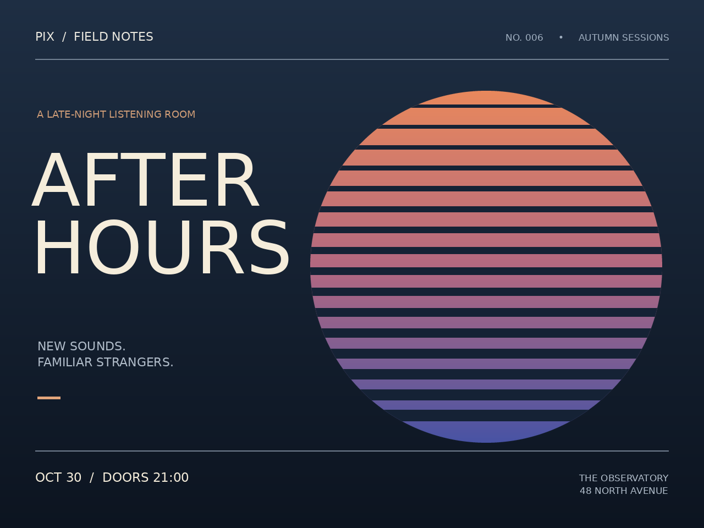

# Pix

**A programmable image-document engine for humans, scripts, and AI agents.**

Pix keeps images editable: layers, text, masks, effects, constraints, variables, and creative history live in a portable `.pix` document. CLI commands, Python, REST, MCP, and AI plans all use one structured operation engine.

This initial implementation covers the specification's core editor and automation, advanced document, provider-based AI, and agent milestones. See the [coverage and limitations](docs/coverage.md) for the precise scope. The supplied [product specification](docs/product-spec.md) is retained as design context.



[Download the editable example](examples/after-hours.pix), or rebuild it with `python examples/build_poster.py`.

## Install on Windows

Download **Pix-Setup-0.8.0-windows-x64.exe** from [GitHub Releases](https://github.com/jxburros/Pix/releases/latest) and run it. The installer bundles Python and the REST/MCP dependencies, installs for your Windows account without administrator access, and adds `pix` to your user PATH. Completely close and reopen your terminal application after installation:

```text
pix --version
pix --help
```

Automatic updates are on by default. When you launch Pix, it checks GitHub at most once a day in the background. A verified update is staged alongside the current version and activated on a subsequent launch. Existing editing sessions continue using their original runtime. Project files and AI credentials are not part of the installation.

```text
pix update --check
pix update
pix updates status
pix updates off
pix updates on
pix update --rollback
```

`pix update` stages an update for the next launch. Rollback selects the previous installed version and turns off automatic updates. [Installation, updates, and release instructions](docs/releases.md) explain migration from a pip install, rollback, and reproducible automation.

## Install with Python / develop from source

Requires Python 3.11 or newer. No graphical display is needed. This method uses pip-managed updates rather than the Windows automatic updater.

```bash
git clone https://github.com/jxburros/Pix.git
cd Pix
python -m venv .venv
# macOS/Linux:
source .venv/bin/activate
# Windows PowerShell: .venv\Scripts\Activate.ps1
python -m pip install -e ".[server,mcp]"
pix --help
```

The core install is `pip install -e .`; REST and MCP are optional extras. A default DejaVu Sans font is bundled, with its license, so basic text works without system fonts.

## A first document

```bash
pix new 1280x720 --background '#121926' -o poster.pix
pix gradient --name atmosphere --start '#243655' --end '#10131c'
pix text add 'AFTER HOURS' --name title --size 100 --color '#f6ecd7'
pix align title center
pix constrain title --center-x canvas --center-y canvas
pix checkpoint layout
pix export poster.png
pix canvas preset story
pix render --out story.png
pix undo
```

Every successful editing command autosaves. `pix open poster.pix` selects a project for the current directory; `pix --project poster.pix ...` makes the project explicit. `pix` alone opens the interactive shell. Quote colors beginning with `#` in scripts and shells.

Add a photo with `pix add photo.jpg --name portrait`; then try:

```bash
pix resize portrait --width 800
pix align portrait top-right --margin 40
pix select rect 0 0 640 720
pix saturation portrait -35
pix select none
pix effects portrait --json
pix undo
```

Selections affect newly added effects and can become layer masks. Images, fonts imported from files, and grayscale masks are embedded; source imagery is not overwritten.

## Automation and creative history

```bash
pix variable set title 'Night Shift'
pix text add '${title}' --name heading --size 80
pix render --set title='Late Edition' --out alternate.png
pix apply operations.json --dry-run
pix apply operations.json
pix run examples/portrait-cleanup.pixscript
pix batch './photos/*.jpg' --run examples/portrait-cleanup.pixscript --output ./processed
pix checkpoint before-color
pix contrast +20
pix branch vivid
pix checkout before-color
pix saturation -30
pix branch muted
pix compare vivid muted --out comparison.png
pix validate
```

`apply` and `run` are atomic. Multi-command transactions survive process restarts:

```bash
pix transaction begin
pix move heading 40 40
pix opacity heading 0.9
pix transaction commit  # or rollback
```

A structured batch looks like:

```json
{"operations": [
  {"type": "scale", "target": "portrait", "value": 0.8},
  {"type": "align", "target": "portrait", "alignment": "top-right", "margin": 40}
]}
```

Use names or immutable IDs. `pix schema` emits JSON Schema, and `pix inspect --json` returns the document and resolved bounds. Machine errors go to stderr with a nonzero exit code. Binary pipelines are supported:

```bash
cat photo.png | pix convert --grayscale > gray.png
cat operations.json | pix apply -
pix export - --format PNG > preview.png
```

## AI and agent interfaces

AI features require a configured external provider; Pix does not ship model weights or simulate AI results. Built-in adapters support OpenAI, ComfyUI API workflows, Automatic1111, and a documented HTTP gateway for vision, segmentation, reasoning, and generation.

```bash
pix ask 'Make the logo 20% smaller and align it top-right with a 40px margin'
pix ask 'Make the logo 20% smaller' --apply
pix select object 'the person' --provider vision
pix generate --prompt 'foggy forest at night' --provider comfy --size 1024x1024 --as forest
pix select rect 100 100 300 300
pix generate --prompt 'a neon sign' --mode inpaint --provider local --as sign
pix ai extend --right 500 --prompt 'continue the scene' --provider local --as extension
pix ai regenerate forest --prompt 'sunlit forest'
```

AI plans are validated and previewed by default. Generation provenance, model, returned seed, source image, and selection are retained. Inpainting inserts a masked layer; background removal adds an editable mask. Provider support varies: [configuration and capabilities](docs/providers.md).

```bash
pix --project poster.pix serve  # local REST API, http://127.0.0.1:8765/docs
pix mcp --workspace .          # MCP over stdio; create/open documents with tools
```

MCP can create/open documents, import images by local path, and export files within its configured workspace. It advertises operation schemas directly, returns compact edit summaries, and bounds previews to 1024 pixels and 1 MiB by default. REST stays scoped to one project. See [interface setup](docs/interfaces.md), including MCP client configuration and authenticated REST access.

## Python API

```python
from pix import Project

project = Project(800, 600, background="#101828")
project.apply([
    {"type": "text", "name": "title", "text": "Hello, Pix", "size": 64},
    {"type": "align", "target": "title", "alignment": "center"},
])
project.save("hello.pix")
project.export("hello.png")
preview = project.render()  # Pillow RGBA Image
```

## Examples, development, and documentation

```bash
python examples/build_poster.py --output examples/output
python -m pip install -e ".[dev]"
pytest -q
python -m pip wheel . --no-deps --wheel-dir dist
```

- [Command reference](docs/commands.md)
- [Operation format and document semantics](docs/operations.md)
- [AI providers](docs/providers.md)
- [REST, MCP, and plugins](docs/interfaces.md)
- [Architecture, security, and limits](docs/architecture.md)
- [Specification coverage and known limitations](docs/coverage.md)

This is an RGBA8 raster engine, not a GIMP file-format implementation. CMYK, RAW development, SVG/vector editing, brushes, animation, desktop GUI/TUI, and GIMP/Photoshop project compatibility are outside this implementation. AI adapter contracts are tested offline; live providers require your own service, model, workflow, and credentials.
